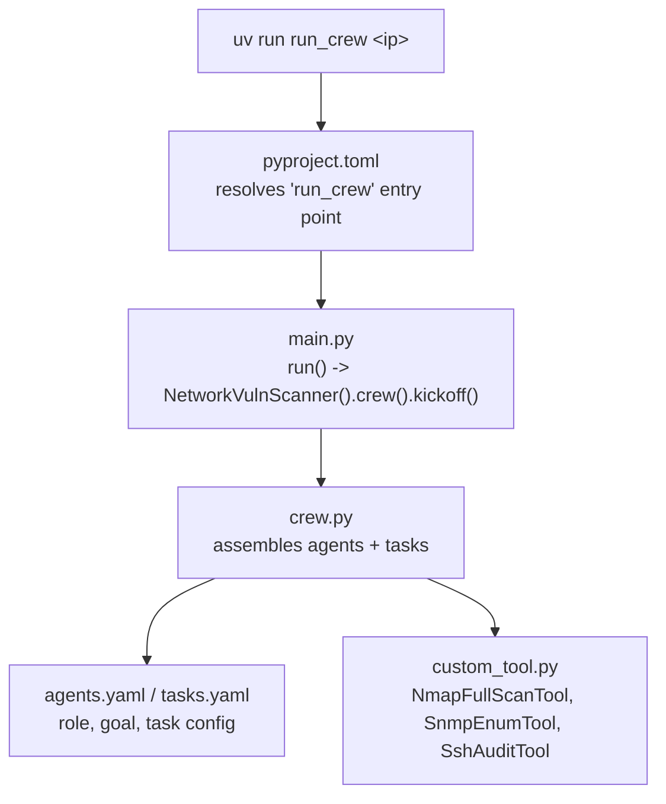
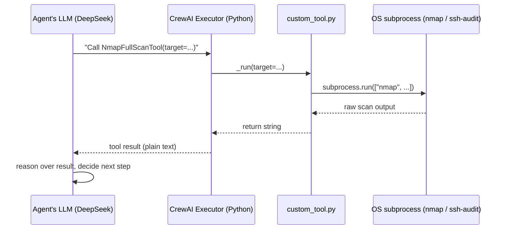

# Execution Flow

How `uv run run_crew <ip>` gets from a keystroke to a finished `report.md`,
and how the agent's LLM and its tools actually collaborate underneath.

## 1. Command resolution

`pyproject.toml` doesn't *execute* anything — it's a lookup table. Running
`uv run run_crew <ip>` resolves through the project like this:

| File | Role |
|---|---|
| `pyproject.toml` | **Registers** — maps the `run_crew` command name to `network_vuln_scanner.main:run`. Never runs code itself. |
| `main.py` | **Triggers** — entry point. Reads the target IP from the CLI arg and calls `.kickoff()`. |
| `crew.py` | **Assembles** — the hub. Builds `Agent`/`Task` objects from `agents.yaml` + `tasks.yaml`, and is the only file that imports from `custom_tool.py`. |
| `custom_tool.py` | **Executes** — the `_run()` methods that actually shell out to `nmap` / `ssh-audit`. |

> `crew.py` is the center of gravity here: it's the only place the YAML
> configs and the tool implementations meet before `main.py` calls
> `.kickoff()` on the result.

## 2. How the agent, the LLM, and a tool collaborate

The LLM never runs code directly — it only ever produces text. Every tool
call is really a round trip through CrewAI's own Python executor:

1. **The LLM decides.** Reading the task description and its available tools
   (`NmapFullScanTool`, `SnmpEnumTool`, `SshAuditTool`), it outputs a
   structured request like *"call the Nmap Full Scan tool with
   `target=192.168.1.1`."* This is just generated text — the model itself
   cannot execute anything.
2. **CrewAI's executor acts.** Plain Python code receives that request,
   matches it to the real `NmapFullScanTool` instance, and calls its
   `_run(target="192.168.1.1")` method.
3. **The tool does the real work.** `custom_tool.py`'s `_run()` runs
   `subprocess.run(["nmap", ...])` — an actual OS process. No LLM is
   involved at this step.
4. **The result flows back.** The tool's return value (raw `nmap` output)
   is handed back to the LLM as plain text, which reasons over it and
   decides what to do next — call another tool, or produce its final
   answer.

**In short:** the LLM is the decision-maker/reasoner; `custom_tool.py` is
where the actual work happens. The loop — *LLM decides → executor runs the
tool → result returns to the LLM → repeat* — continues until the LLM
produces a final answer instead of another tool call.
